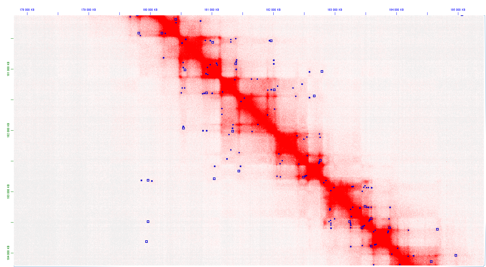

# juicer-to-deeploop

Bridge between Juicer's `.hic` output and the DeepLoop algorithm for chromatin loop detection from Hi-C data.

**juicer-to-deeploop** is a streamlined pipeline that automates the detection of chromatin loops from Hi-C data. It acts as a bridge between **Juicer Tools** (for data extraction) and **DeepLoop** (for deep learning based denoising), producing loop calls in `.bedpe` format compatible with Juicebox for visualization.

## Pipeline Logic

1. **Juicer Dump** — Extracts Observed (raw) and OE (Observed/Expected) KR-normalized matrices from the `.hic` file.
2. **Pre-processing** — Merges matrices, calculates expected values required by DeepLoop, and handles padding to prevent crashes on chromosome edges. Uses memory-efficient chunk-based processing suitable for high-resolution data.
3. **DeepLoop** — Runs the neural network to denoise the contact map and assign loop probabilities to each pixel.
4. **Filtering & Clustering** — Converts the probability map to a list of loops via DBSCAN clustering, filtering out diagonal artifacts and applying a score threshold.
5. **Multiresolution Merge** — Merges loop calls across all resolutions using a kD-tree spatial index, collapsing redundant calls within a configurable tolerance window.

## Prerequisites

Before running the pipeline, ensure you have the following installed:

1. **Juicer Tools** — developed by Aidenlab

   https://github.com/aidenlab/juicer

   Durand et al. "Juicer provides a one-click system for analyzing loop-resolution Hi-C experiments." *Cell Systems* 3(1), 2016.

2. **DeepLoop** — developed by JinLab

   https://github.com/JinLabBioinfo/DeepLoop

   Zhang et al. "DeepLoop robustly maps chromatin interactions from sparse allele-resolved or single-cell Hi-C data at kilobase resolution." *Nat Genet* 54, 1013–1025 (2022).

## Repository Structure

```text
juicer-to-deeploop/
├── README.md
├── config/
│   └── config.yaml                   # Paths to Juicer and DeepLoop (edit this)
├── envs/
│   └── environment.yaml              # Conda environment definition
├── juicer-to-deeploop.sh             # Main pipeline script
└── scripts/
    ├── export_juicer_data.sh         # Juicer dump wrapper
    ├── process_juicer_output.py      # Pre-processing (chunk-based, memory-efficient)
    ├── deeploop_to_bedpe.py          # DBSCAN clustering -> BEDPE
    └── merge_loops.py                # Multiresolution loop merging
```

## Installation

### 1. Clone the repository

```bash
git clone https://github.com/Hartecky/juicer-to-deeploop
cd juicer-to-deeploop
```

### 2. Set up the Conda environment

```bash
conda env create -f envs/environment.yaml
conda activate juicer-to-deeploop
```

### 3. Configure paths

Edit `config/config.yaml` to point to your local installations:

```yaml
juicer_jar: "/absolute/path/to/juicer_tools.jar"
deeploop_dir: "/absolute/path/to/DeepLoop"

model_h5: "DeepLoop_models/CPGZ_trained/LoopDenoise.h5"
model_json: "DeepLoop_models/CPGZ_trained/LoopDenoise.json"
```

> **Note:** Pre-trained DeepLoop models are available at the JinLab repository. The pipeline expects them under `$deeploop_dir/DeepLoop_models/CPGZ_trained/`.

## Usage

```bash
bash juicer-to-deeploop.sh [OPTIONS]

Required Arguments:
  -i, --input      <FILE>   Path to input .hic file
  -c, --chrom      <STR>    Chromosome name (e.g., chr1)
  -r, --res        <LIST>   Comma-separated resolutions (e.g., 2000,5000,10000)
  -n, --norm       <STR>    Normalization type (KR, SCALE, VC, VC_SQRT, GW_SCALE, INTER_SCALE)
  -o, --out        <DIR>    Output directory path

Optional Arguments:
  -t, --tolerance  <INT>    Merge tolerance in bp (Default: 20000)
  -k, --chunk-size <INT>    Rows per chunk for memory-efficient processing (Default: 2000000)
  -h, --help                Show this help message
```

### Example

```bash
bash juicer-to-deeploop.sh \
    --input  data/GM12878.hic \
    --chrom  chr1 \
    --res    25000,10000,5000 \
    --norm   KR \
    --out    results/GM12878_chr1
```

On machines with limited RAM (≤16 GB), reduce chunk size for high-resolution data:

```bash
bash juicer-to-deeploop.sh \
    --input      data/GM12878.hic \
    --chrom      chr1 \
    --res        25000,10000,5000 \
    --norm       KR \
    --out        results/GM12878_chr1 \
    --chunk-size 1000000
```

## Optional Tuning

Resolution-specific DBSCAN and filtering parameters are defined inside `juicer-to-deeploop.sh`. Example for 5000 bp:

| Parameter             | Value | Description                                    |
|-----------------------|-------|------------------------------------------------|
| `CURRENT_THRESHOLD`   | 0.80  | Minimum DeepLoop score (keeps top 20% signals) |
| `CURRENT_MIN_DIST`    | 4     | Minimum bin distance from diagonal             |
| `CURRENT_EPS`         | 3.0   | DBSCAN neighborhood radius (in bins)           |
| `CURRENT_MIN_SAMPLES` | 2     | Minimum points to form a DBSCAN cluster        |

## Outputs

```text
results/
├── final_bedpe/
│   ├── chr1_25000_loops.bedpe         # Loops per resolution
│   ├── chr1_10000_loops.bedpe
│   ├── chr1_5000_loops.bedpe
│   └── chr1_merged_multires.bedpe     # Final merged result (main output)
├── deeploop_out/                      # Raw DeepLoop probability matrices
├── deeploop_in/                       # Pre-processed input files for DeepLoop
├── raw_dumps/                         # Observed and OE matrices from Juicer
├── anchors/
│   ├── 25000/chr1.bed                 # Resolution-specific BED anchor files
│   ├── 10000/chr1.bed
│   └── 5000/chr1.bed
└── logs/
    ├── pipeline_chr1_<timestamp>.log      # Full run log
    └── final_summary_chr1_<timestamp>.txt # Per-resolution loop counts and runtime
```

The `.bedpe` files in `final_bedpe/` can be loaded directly in **Juicebox** alongside the original `.hic` file for visual inspection.

## Performance

Benchmarked on **GM12878 in-situ Hi-C** (Rao et al. 2014, GEO: GSE63525), chromosome 1 (~249 Mbp), resolutions 25000/10000/5000 bp, KR normalization.

**Hardware:** 12th Gen Intel Core i5-12450H (2.00 GHz), 16 GB RAM, WSL2 Ubuntu (no GPU)

| Resolution | Loops detected | Runtime  |
|------------|---------------|----------|
| 25 000 bp  | 2 604         | ~15 min  |
| 10 000 bp  | 3 794         | ~25 min  |
|  5 000 bp  | 4 214         | ~35 min  |
| **Merged** | **9 948**     | **~76 min total** |

> Memory note: processing chr1 at 5000 bp resolution generates ~61M interactions. The default chunk size of 2 000 000 rows keeps peak RAM usage under 4 GB. On machines with ≤16 GB RAM, use `--chunk-size 1000000`.

## Example Output

Loops detected in GM12878 chr1 visualized in **Juicebox** alongside the original `.hic` contact map (data: Rao et al. 2014, Aidenlab).
The contact map shows a region of GM12878 chr1 (178–185 Mb) at 5 kb resolution, visualized in Juicebox. The red heatmap represents Hi-C contact frequency — darker red indicates stronger chromatin interactions. Blue squares mark loop calls produced by the pipeline. The calls align well with the prominent topological domains (TADs) visible along the diagonal, and several loops are correctly anchored at domain boundaries, which is consistent with known CTCF-mediated looping in GM12878. A visible positional shift in some loop calls relative to the brightest pixels of the contact map suggests that DBSCAN clustering parameters (particularly eps and min_samples) have room for further tuning — tighter clustering at 5 kb resolution may better center calls on peak signal.




## TODO

- Benchmark runtime and memory usage across different sequencing depths and resolutions
- Evaluate alternative DeepLoop thresholding strategies and their effect on DBSCAN parameters
- Add genome-wide loop calling mode (iterate over all chromosomes)
- Add support for multi-sample comparison (differential loop calling)